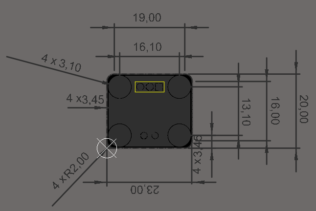
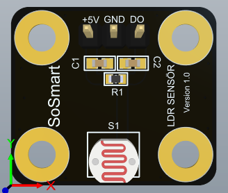
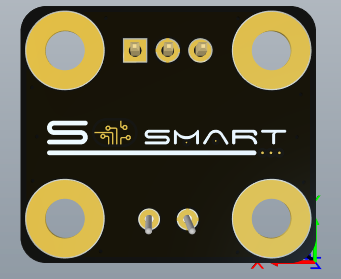
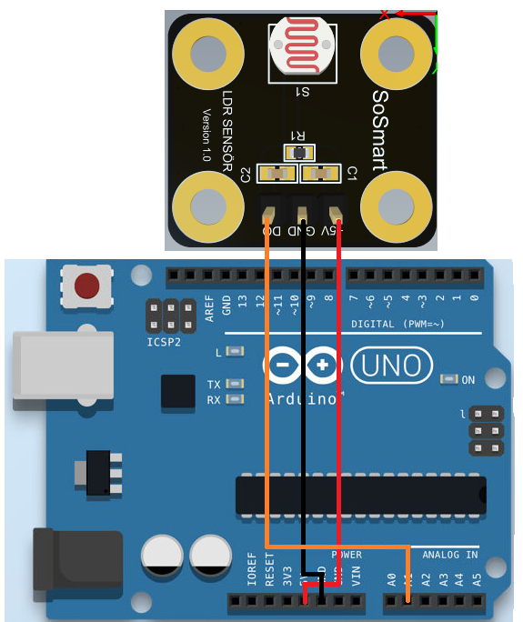
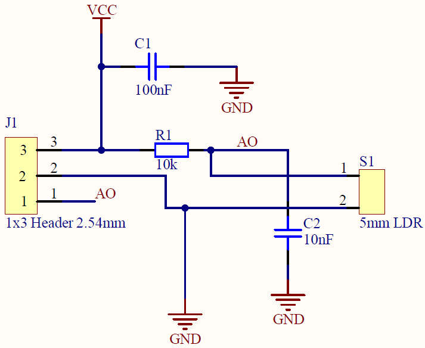

#  LDR Sensör Kartı

### 1. KAPSAM

Bu döküman LDR Sensör Kart'ının tanımını ve çalışma prensibini açıklar.

### 2. ÜRÜN PARAMETRELERİ

- 1 Çalışma Gerilimi:DC +5V
- 2 Çalışma Sıcaklığı:-60 °C  ~ +75 °C 
- 3 Karanlıktaki Direnci: 1MΩ
- 4 Hücre Direnci:400Ω

### 3. MEKANİK





Pdf [LDR](Mechanic/LDR.pdf)

### 4. PİN AÇIKLAMALARI

|Pin Adı|Açıklama|
|------|------|
|+5V|DC +5V besleme girişi|
|GND|Toprak bağlantı pimi|
|DO|Analog çıkış pimi|

### 5. Arduino Bağlantısı



### 6. Devre


Sch File [LDRModule](Circuit/LDR.pdf) 

Bom List [BomList](Circuit/LDR_BomList.pdf) 

Gerber File [Gerber](Circuit/LDR_Gerber.zip)

### GENEL BAKIŞ 
LDR Sensör Kartı Ldr sensörlerinin elektronik uygulamalarına kolaylık sağlaması açısından tasarlanmıştır.Prototiplemeye imkan sağlaması, arduino ve çeşitli devrelerde rahatça kullanılabilmesi için gerekli pinler devre kartı sayesinde dışarıya alınmıştır.Standart pin yapısı sayesinde rahatça kontrol edilebilir. Jumper kablolar ile bağlantıları yapılabilir. Detaylı bilgi için linkler incelenebilir.
### Arduino Örnek Kodu
```
void setup() {
  Serial.begin(9600);
}
void loop() {
  int sensorDegeri = analogRead(A1);
  Serial.println(sensorDegeri); 
  delay(10); 
}
```

[LDRsensor](ArduionoExample/LDRsensor/LDRsensor.ino)
